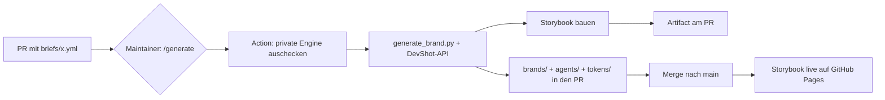

# AI Corporate Design Generator

Öffne einen Pull Request mit einem **Marken-Brief** – eine GitHub Action erzeugt
daraus automatisch:

- **`brands/<marke>.md`** – ein vollständiges Markenprofil (KI-lesbar, mit Design-Tokens)
- **`agents/<marke>.agent.md`** – destillierte **Agent-Instructions** für KI-Agenten
- **`tokens/<marke>.tokens.json`** – die Design-Tokens
- ein **fertiges Storybook**, das die Marke live zeigt (Farben, Typografie, Komponenten)

Die eigentliche Generierungs-Logik („die Magic") liegt in einem separaten,
**privaten** Engine-Repository; dieses Repo ist die öffentliche Vordertür.

## So trägst du eine Marke bei

1. Kopiere `briefs/_TEMPLATE.yml` nach `briefs/<deine-marke>.yml` und fülle sie aus
   (Pflicht ist nur `name`).
2. Öffne einen Pull Request mit dieser Datei.
3. Ein:e Maintainer:in stößt die Generierung an mit einem Kommentar:
   ```
   /generate briefs/<deine-marke>.yml
   ```
4. Die Action committet die generierten Artefakte in deinen PR und hängt das
   gebaute Storybook als Build-Artifact an. Nach dem Merge geht das Storybook live.

> [!note] Warum ein Maintainer den Start auslöst
> Dieses Repo ist öffentlich. Der KI-Key liegt als GitHub-Secret vor und darf aus
> Sicherheitsgründen **nicht** durch beliebige Fork-PRs auslösbar sein. Deshalb ist
> die Generierung maintainer-gated (siehe [SETUP.md](SETUP.md)).

## Ablauf



## Live-Storybook

Nach dem ersten Merge: **https://anticipaterdotcom.github.io/ai-corporate-design-generator/**
(GitHub Pages muss einmalig aktiviert werden – siehe [SETUP.md](SETUP.md)).

## Struktur

| Ordner | Inhalt |
| --- | --- |
| `briefs/` | Eingabe: Marken-Briefs (von Contributoren per PR) |
| `brands/` | Ausgabe: generierte Markenprofile (KI-MD) |
| `agents/` | Ausgabe: Agent-Instructions je Marke |
| `tokens/` | Ausgabe: Design-Tokens (Basis fürs Storybook) |
| `.github/workflows/` | Generierung (maintainer-gated) + Pages-Deploy |

## Beispiele

`tokens/` enthält 10 fiktive Beispielmarken, damit das Storybook von Anfang an
gefüllt ist. `briefs/example-aurora-labs.yml` zeigt einen ausgefüllten Brief.

Siehe auch [CONTRIBUTING.md](CONTRIBUTING.md) und [SETUP.md](SETUP.md).
