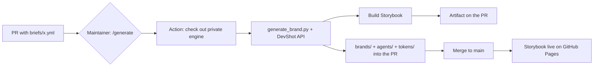

# AI Corporate Design Generator

Open a pull request with a **brand brief** — a GitHub Action automatically produces:

- **`brands/<brand>.md`** — a complete brand profile (AI-readable, with design tokens)
- **`agents/<brand>.agent.md`** — distilled **agent instructions** for AI agents
- **`tokens/<brand>.tokens.json`** — the design tokens
- a **finished Storybook** that shows the brand live (colors, typography, components)

The actual generation logic ("the magic") lives in a separate, **private** engine
repository; this repo is the public front door.

> All CI runs on **self-hosted runners** (`[self-hosted, Linux, X64]`).

## How to contribute a brand

1. Copy `briefs/_TEMPLATE.yml` to `briefs/<your-brand>.yml` and fill it in
   (only `name` is required).
2. Open a pull request with that file.
3. A maintainer triggers generation with a comment:
   ```
   /generate briefs/<your-brand>.yml
   ```
4. The Action commits the generated artifacts into your PR and attaches the built
   Storybook as a build artifact. After merge the Storybook goes live.

> [!note] Why a maintainer starts the run
> This repo is public. The AI key is a GitHub secret and must **not** be
> triggerable by arbitrary fork PRs. Generation is therefore maintainer-gated
> (see [SETUP.md](SETUP.md)).

## Flow



## Live Storybook

**https://anticipaterdotcom.github.io/ai-corporate-design-generator/**

Builds from `tokens/` and deploys via GitHub Pages — no secrets required. Switch
between brands with the **"Brand"** control in the toolbar.

## Layout

| Folder | Contents |
| --- | --- |
| `briefs/` | Input: brand briefs (submitted by contributors via PR) |
| `brands/` | Output: generated brand profiles (AI-MD) |
| `agents/` | Output: agent instructions per brand |
| `tokens/` | Output: design tokens (source for the Storybook) |
| `storybook/` | Storybook viewer (brand switcher, token-themed) |
| `.github/workflows/` | Generation (maintainer-gated) + Pages deploy |

## Examples

`tokens/` ships with 10 fictional example brands so the Storybook is populated
from the start. `briefs/example-aurora-labs.yml` shows a filled-in brief.

See also [CONTRIBUTING.md](CONTRIBUTING.md) and [SETUP.md](SETUP.md).
