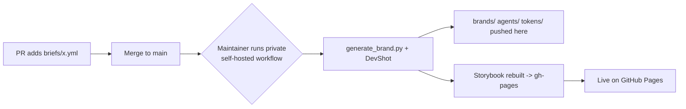

# AI Corporate Design Generator

A public showcase of AI-generated brand systems. Each brand ships as:

- **`brands/<brand>.md`** — a complete brand profile (AI-readable, with design tokens)
- **`agents/<brand>.agent.md`** — distilled **agent instructions** for AI agents
- **`tokens/<brand>.tokens.json`** — the design tokens
- a live entry in the **Storybook** (colors, typography, components)

## Live Storybook

**https://anticipaterdotcom.github.io/ai-corporate-design-generator/**

Served by GitHub Pages **from the `gh-pages` branch** — no CI runner on this repo.
Switch between brands with the **"Brand"** control in the toolbar.

> [!note] No runners on this public repo
> All compute (brand generation + Storybook build) runs on **self-hosted runners**
> in a separate **private** engine repository. This public repo holds only the
> published content and the static site; it runs no GitHub Actions itself.

## How to contribute a brand

1. Copy `briefs/_TEMPLATE.yml` to `briefs/<your-brand>.yml` and fill it in
   (only `name` is required).
2. Open a pull request with that brief.
3. After review/merge, a maintainer runs the **private** self-hosted
   `Generate Brand` workflow with your brief path. It generates
   `brands/`, `agents/`, `tokens/`, commits them here, and republishes the Storybook.

## Layout

| Folder | Contents |
| --- | --- |
| `briefs/` | Input: brand briefs (submitted via PR) |
| `brands/` | Generated brand profiles (AI-MD) |
| `agents/` | Generated agent instructions per brand |
| `tokens/` | Design tokens (source for the Storybook) |
| `storybook/` | Storybook viewer source (built on the self-hosted side) |
| `gh-pages` branch | The built static Storybook served by Pages |

`tokens/` ships with 10 fictional example brands so the Storybook is populated
from the start. Brands are **fictional** — no real companies or trademarks.

See [CONTRIBUTING.md](CONTRIBUTING.md) and [SETUP.md](SETUP.md).
